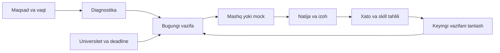

# IELTS Nation tahlili va Sirius rivojlanish rejasi

Tadqiqot sanasi: **2026-yil 5-oktabr**, Asia/Tashkent.

**Implementatsiya holati:** [bajarilgan ishlar va ochiq bosqichlar](sirius-implementation-2026-10-05.md). Savollarni tayyorlash uchun [JSON yo‘riqnomasi](../content/SAVOLLARNI-JSON-QILISH.md).

**Asosiy qaror:** IELTS Nation’dan foydalanuvchini keyingi foydali harakatga yetaklash usulini olish kerak. Sirius’ning yulduz belgisi, Bluebook Bright palitrasi, tipografikasi, animatsiya xarakteri va SAT + universitetlarga topshirish yo‘nalishi saqlanadi.

## 1. Tekshiruv doirasi va dalillar

IELTS Nation’ning ochiq sahifalari hamda foydalanuvchi login qilgan akkauntdagi asosiy bo‘limlar brauzer orqali tekshirildi. Sirius esa mavjud kod, ma’lumot modellari va komponentlar asosida audit qilindi; uning serveri va production bazasi bu tadqiqotda tekshirilmadi.

Dalillar uch turga ajratilgan:

- **Kuzatilgan UI:** sahifa, boshqaruv elementi yoki holat haqiqiy brauzerda ko‘rildi.
- **Amalda sinalgan:** menyu, tab, filtr, vazifa tafsiloti, practice ekraniga kirish, saqlab chiqish yoki bitta AI javobi tekshirildi.
- **Xizmat va’dasi:** rasmiy sahifada yozilgan, lekin ishlashi yoki sifati mustaqil tekshirilmagan.

Ochiq sahifaning web indeksidagi matni joriy brauzer ko‘rinishidan farq qildi. Dizayn xulosalari jonli ko‘rinishga tayangan. Eski marketing matnidagi Drills va Question bank joriy navigatsiyada alohida bo‘lim sifatida tasdiqlanmadi.

Akkauntda bitta umumiy Bandy suhbat namunasi yaratildi. Reading Passage 1 practice ekrani ochildi va javob yubormasdan Save and exit orqali chiqildi; boshlanmagan/bajarilmagan urinish saqlangan bo‘lishi mumkin. Yangi test natijasi, essay bahosi yoki Speaking bahosi yuborilmadi. To‘lov, bildirishnoma, parol va reja sozlamalari o‘zgartirilmadi.

Ko‘rilgan asosiy yo‘nalishlar:

| Yo‘nalish | Tekshiruv |
|---|---|
| Landing | Hero, asosiy CTA, navigatsiya, 8 tabli platforma namoyishi, ijtimoiy dalillar, kafolat, FAQ |
| Onboarding va login | Kirish ekranlari; onboarding’ning birinchi qadami |
| Dashboard | Haqiqiy akkaunt holati, bugungi vazifalar, ko‘nikmalar, streak, so‘nggi test |
| Plan | Kalendar, vazifa tafsiloti va Adjust plan oynasi |
| Reading | Katalog, tayyorlov, passage practice interfeysi, saqlab chiqish |
| Listening | Katalog, tayyorlov, Strict/Chill tanlovi |
| Writing va Speaking | Kataloglar va test/bo‘lim bo‘yicha tayyorlov ekranlari |
| Progress | Overview, davr tanlovi, History va mavjud Speaking natijasi |
| Vocabulary | Bo‘sh bank, recognition/production/mixed, daraja va manba filtrlari |
| Bandy AI | Chat, tarix, taklif savollari, bitta o‘zbekcha javob |
| Games | 3 o‘yin katalogi, Bandy Run boshlash ko‘rsatmalari |
| Resources | 117 material ko‘rsatilgan katalog, Writing filtri, bitta maqola tuzilishi |
| Settings | Parol, notifications, subscription/billing ko‘rinishi |
| Ochiq axborot | How it works, Pricing, Guides, Guarantee; About/Terms/Privacy rasmiy matnlari |

## 2. Dizaynning kuchli tomoni

IELTS Nation’da qora, sariq va iliq oq asos ishlatilgan. Katta sarlavha, qisqa izoh va sariq asosiy tugma ko‘zni bir harakatga yo‘naltiradi. Yumaloq kartalar va maskot interfeysni do‘stona qiladi. Landing’da foydalanuvchi mahsulot ichidagi ekranlarni ro‘yxatdan o‘tmasdan ko‘ra oladi. [Jonli bosh sahifa](https://www.ieltsnation.com/).

Sirius uchun bu quyidagi dizayn qarorlarini anglatadi:

1. **Har ekranda bitta eng muhim harakat.** “Mashq qilish”, “Davom ettirish” yoki “Ariza vazifasini bajarish”ning bittasi vizual ustun bo‘lsin. Hamma tugma bir xil kuchli rangda bo‘lmasin.
2. **Katta blokning aniq vazifasi.** Qoramtir yoki kuchli aksentli karta foydalanuvchiga nimani boshlashini aytsin; faqat bezak yoki raqam bo‘lmasin.
3. **Matn + raqam + harakat birga.** “8 ta xato” o‘rniga “8 ta xatoni ko‘rib chiqish · taxminan 12 daqiqa” foydaliroq.
4. **Interfeys bo‘ylab takrorlanuvchi tuzilma.** Sarlavha, qisqa izoh, asosiy harakat, qo‘shimcha filtrlar va kontent bir xil mantiqqa ega bo‘lsin.
5. **Yangi foydalanuvchiga haqiqiy ekran ko‘rsatish.** Sirius landing’iga mavjud practice, reja, lug‘at va universitet oqimidan qisqa namoyish qo‘shish mumkin. Namuna ma’lumotlar aniq belgilansin.

IELTS Nation’ning sariq palitrasi, maskoti, matnlari yoki ekranlarini nusxalash Sirius uchun kerak emas. Qulaylikni yaratgan ierarxiya va harakatlar tizimi ko‘chiriladi.

## 3. Dashboard: foydalanuvchi nimani darhol tushunadi?

Dashboard’da maqsadga oid katta blok, to‘rtta ko‘nikma, bugungi vazifalar, faollik va so‘nggi testlar bor. Vazifada vaqt ko‘rsatilgani boshlash qarorini osonlashtiradi. Har bir ko‘nikma tegishli testga olib boradi. [Dashboard](https://www.ieltsnation.com/app/dashboard).

**Sirius’da qo‘llash:** dashboard mavjud universitet va deadline qiymatini saqlab, bugungi o‘quv vazifasini ham ko‘rsatishi kerak. Foydalanuvchi /plan’ga kirib vazifa qidirmasin.

Tavsiya etilgan tartib:

| Ustuvorlik | Blok | Savolga javob |
|---|---|---|
| 1 | Bugungi eng muhim ish / davom etayotgan sessiya | Hozir nima qilaman? |
| 2 | Yaqin universitet deadline’i yoki ariza vazifasi | Nima kechiktirib bo‘lmaydi? |
| 3 | So‘nggi ishonchli SAT natijasi va maqsad | Qayerdaman? |
| 4 | Eng muhim 2–3 skill va xatolar | Nimani yaxshilayman? |
| 5 | Universitet shortlist’i va ariza bosqichlari | Qayerga topshiryapman? |
| 6 | Lug‘at takrorlash va haftalik faollik | Odatim qanday ketmoqda? |

Deadline yaqin bo‘lsa ariza vazifasi birinchi blokka ko‘tarilishi mumkin. Bu tanlov foydalanuvchiga tushuntiriladi.

**Mobil kuzatuv:** 390 px ko‘rinishda asosiy navigatsiya pastda; dashboard mazmuni bitta ustunga o‘tadi, skill kartalari ikki ustunda qoladi. Tekshirilgan dashboardda sahifa darajasida gorizontal overflow kuzatilmadi. Biroq welcome bloki katta: bugungi haqiqiy vazifalar uchun ancha pastga tushish kerak bo‘ldi.

Sirius’da dastlabki tushuntirish ixcham bo‘lsin; asosiy vazifa birinchi ko‘rinadigan mazmunga yaqin joylashsin. Mavjud drawer va AppNav saqlanadi. Pastki navigatsiya foydasini student task test’i bilan tekshirib, zarur bo‘lsa qo‘shish mumkin.

## 4. Reja: eng foydali mahsulot mexanizmi

Plan sahifasida bugungi faoliyat alohida ajratilgan, undan keyin kalendar keladi. Vazifa tafsiloti vaqt, mazmun va boshlash harakatini beradi. Adjust plan oynasida target band, boshlang‘ich daraja, exam date, hours per week va study days bir joyda. [Plan](https://www.ieltsnation.com/app/plan).

Rasmiy tayyorgarlik mantiqi: maqsad → diagnostika → kundalik mashq → feedback → yangilangan reja. Bu yopiq o‘quv sikli Sirius uchun eng katta dars. [How it works](https://www.ieltsnation.com/how-it-works).

Sirius’da shunday sikl quriladi:

Sirius’da haftalik study plan allaqachon bor. Yangi reja engine’i yozishdan oldin mavjud task’larni dashboard bilan ulash va o‘quvchi profilidagi sana/vaqtni tahrirlashni ochish kerak.

Adaptatsiya uchun:

- Diagnostika va keyingi valid natijalar boshlang‘ich darajani yangilasin.
- Skill’ga oid to‘g‘ri/xato javoblar, vaqt va qayta urinishlar hisobga olinsin.
- Juda oz javob bilan “sizning eng kuchsiz skill’ingiz” qat’iy aytilmasin.
- Reja mavjud savollar va foydalanuvchi vaqtiga mos tushsin.
- “Bu hafta algebra ko‘paydi, chunki so‘nggi mashqlarda shu mavzuda xatolar ko‘p” kabi sabab berilsin.
- Qayta tuzish bajarilgan tarixni yo‘qotmasin.
- O‘tkazib yuborilgan kun uchun real, yengil qaytish vazifasi taklif qilinsin.

## 5. Test interfeysi va mashq rejimi

Haqiqiy katalogda Reading 50, Listening 37, Writing 53 va Speaking 53 test ko‘rsatildi. Bu UI’dagi sonlar; har bir testning sifati va ishlashi tekshirilmadi. [Tests](https://www.ieltsnation.com/app/mock-tests).

Foydali kuzatuvlar:

- Test oldi ekrani vaqt, savol/bo‘lim soni va formatni aytadi.
- Reading’ni passage, Writing’ni task, Speaking’ni part, Listening’ni section bo‘yicha boshlash mumkin.
- Reading practice’da taymer, flag, savol navigatori, Submit va saqlab chiqish bor.
- Kichik ekranda passage va savollar tab orqali ajratiladi.
- Listening tayyorlovida Strict va Chill tanlovi mavjud; audioning amaldagi ijrosi va davom ettirish holati sinalmadi.

**Sirius uchun:** qisqa mashq va to‘liq mock bitta tushunarli practice markazida bo‘lsin. Boshlashdan oldin uzunlik, vaqt va rejim aniq ko‘rsatiladi.

O‘rganish rejimida lug‘at, izoh va yordamchi vositalar ko‘rinishi mumkin. Mock rejimida qaysi yordamlar o‘chirilishi aniq qoidaga ega bo‘lsin. Foydalanuvchi qaysi rejimda ekanini unutmasin.

Mavjud Sirius simulator va practice runner qayta yozilmaydi. Ularga aniq saqlash holati, davom ettirish kirish nuqtasi va natijadan qayta mashqqa yo‘l qo‘shiladi.

## 6. Natijalar va progress

IELTS Nation Progress sahifasida vaqt davri, ko‘nikma tablari, tarix va qisqa insights mavjud. Mavjud Speaking natijasida umumiy band, to‘rtta mezon, part tafsiloti, transcript va keyingi harakatlar ko‘rildi. Bu natijada baholashga yetarli nutq bo‘lmagani yozilgan; shu sabab normal Speaking baholash aniqligi haqida xulosa chiqarilmadi. [Progress](https://www.ieltsnation.com/app/results).

**Sirius uchun natija ekranining tartibi:**

1. Ishonchli natija va uning turi: diagnostika, mashq yoki mock.
2. Qaysi skill’larda muammo ko‘rindi.
3. Savoldagi xato sababi va tekshirilgan izoh.
4. Shu mavzudan qisqa qayta mashq.
5. Rejaga qanday ta’sir qilgani.

Oddiy practice accuracy’si bilan taxminiy SAT balli bitta o‘lchovga aralashtirilmasin. Ball konversiyasi kalibratsiya qilinmaguncha estimate ekanligi aniq qoladi.

Sirius dashboard’da oddiy practice natijalari ham ko‘rinsin. Hozir har kuni mashq qilgan, ammo mock topshirmagan studentning asosiy SAT statistikasi bo‘sh qolishi mumkin.

## 7. Lug‘at, resurslar va odat

Vocabulary’da recognition, production va mixed rejimlari bor. Daraja va so‘z manbasi filtrlari ko‘rinadi. Bo‘sh bank studentni Reading testga yo‘naltiradi. Takrorlash oralig‘i qanday hisoblanishi mazkur akkauntdagi bo‘sh bank sabab amalda tekshirilmadi. [Vocabulary](https://www.ieltsnation.com/app/flashcards).

Sirius’da so‘z saqlash allaqachon bor. Keyingi qiymat — saqlangan so‘zni qayta eslashga qaytarish:

- “Bugun takrorlash” navbati.
- So‘z → ma’no va ma’no → so‘z mashqlari.
- So‘z uchragan asl kontekst.
- Bilinmagan so‘zlarni tezroq, yaxshi eslanganlarni keyinroq qaytarish.
- Qidiruvda natija yo‘q bo‘lsa aniq holat va filtrni tozalash.

Resources’da skill, vaqt va darajaga ko‘ra tavsiflangan maqola/video kartalari bor. Writing filtri sinaldi. Bitta maqolada sarlavhalarga bo‘lingan matn va Mark as complete harakati ko‘rildi. Matndan highlight orqali lug‘atga qo‘shish va’dasi bor; bu amal bajarilmadi. [Resources](https://www.ieltsnation.com/app/resources).

Sirius uchun har bir muhim skill’ga qisqa qo‘llanma, original misol va undan keyingi mashq kerak. Katta kutubxona sonidan ko‘ra “xato → tushuntirish → mashq” bog‘lanishi muhimroq.

Games’da Bandy Run, Bandy Blast va Bandy Type bor; Bandy Run yo‘riqnomasi tekshirildi, o‘yinlar yakunlanmadi. [Games](https://www.ieltsnation.com/app/games).

Sirius’da avval real mashqdan keladigan haftalik faollik, kichik milestone va qaytish vazifasini qurish foydali. Murakkab o‘yin yoki reyting jadvali keyingi ustuvorlikda.

## 8. Bandy sinovi va AI uchun dars

Bandy’ga o‘zbekcha False va Not Given farqini tushuntirish so‘raldi. Javob qaytdi va chat tarixda saqlandi. Ta’rif foydali edi, ammo misolda muammo bor: matnda Oyda muz topilgani aytilsa, bundan suyuq suv mavjud emasligi kelib chiqmaydi. Bandy esa suyuq suv haqidagi gapni False deb belgiladi.

Rasmiy IELTS qoidasida False uchun matnga zid ma’lumot kerak; tasdiqlanmagan va inkor etilmagan gap Not Given bo‘ladi. Berilgan qisqa matn asosida Not Given javobi asosliroq. Bu bitta pedagogik kamchilik kuzatuvi; butun AI tizimining aniqlik foizi emas. [Rasmiy IELTS Reading qoidasi](https://ielts.org/take-a-test/test-types/ielts-academic-test/ielts-academic-format-reading).

Sirius’dagi AI:

- Tekshirilgan javob kaliti va o‘qituvchi yozgan explanation’ga tayansin.
- Student natijasidagi aniq savol/skill kontekstini olsin.
- Baholashni o‘zgartirishdan ko‘ra izoh va yo‘naltirishdan boshlansin.
- Izoh bilan birga tekshiriladigan dalil yoki hisoblash qadami bersin.
- O‘zbekcha tushuntirish sifati alohida baholansin.
- Noto‘g‘ri tavsiya, ishonchsiz javob, kechikish va xarajat uchun monitoring bo‘lsin.

Dastlabki AI sinov korpusi: kamida 50 turli misol — Reading mantiqi, grammatika, algebra, problem solving va noaniq prompt’lar. O‘qituvchi belgilagan javoblar bilan solishtirib, xato turlari yoziladi. Bu son ishni boshlash uchun taklif; statistik aniqlik kafolati emas.

## 9. IELTS Nation’da takrorlamaslik kerak bo‘lgan holatlar

| Kuzatilgan holat | Sirius’dagi to‘g‘ri yo‘l |
|---|---|
| O‘zbekcha bannerlar bilan inglizcha asosiy interfeys aralash | UI matnlarini to‘liq i18n qilish; test kontenti tilini alohida saqlash |
| Dashboard’da exam date yo‘q, Plan esa “8 weeks to exam day” deydi | Standart 8 haftalik reja bilan haqiqiy imtihongacha vaqtni farqlash |
| Yetarli nutq yo‘q natija 0.0 bo‘lib, overall forecast/weakest skill’da ishlatiladi | NOT_ASSESSABLE holati; bunday urinish mastery va prognozga qo‘shilmaydi |
| Bo‘sh lug‘atda yuqori karta “All caught up” deydi, pastda bank bo‘shligi aytiladi | “Hali so‘z qo‘shilmadi” bilan “Takrorlash tugadi”ni ajratish |
| Add words tugmasi Reading katalogiga olib boradi | Tugma natijani aniq aytsin: “Reading’dan so‘zlar qo‘shish”; manual add bo‘lsa alohida |
| Welcome kartasi mobilda bugungi ishni pastga suradi | Ixcham onboarding va birinchi foydali harakatni yuqorida ko‘rsatish |
| Onboarding’da 7 savol va’dasi bilan 1/14 progress ko‘rsatiladi | Savollar va barcha ekranlar soni o‘rtasidagi farqni tushuntirish |
| Bitta AI misolida dalilsiz inkor | Grounded explanation va o‘qituvchi baholagan eval korpusi |
| Public [About](https://www.ieltsnation.com/about) va [Pricing](https://www.ieltsnation.com/pricing) boshlang‘ich narxlari bir xil emas | Narx va tarif copy’sini bitta manbadan chiqarish |

Bu kuzatuvlar bir akkaunt va tanlangan ekranlar doirasida. Har bir ko‘rinish xizmatning butun foydalanuvchi bazasida bir xil bo‘lishi tasdiqlanmagan.

## 10. Narx, lokal bozor va conversion

Pricing sahifasida 1 oy 135 000 UZS, 3 oy 195 000 UZS jami va 6 oy 325 000 UZS jami ko‘rsatilgan. 3 oy tavsiya qilingan variant; 6 oy uchun oyiga taxminan 54 000 UZS ta’kidlangan. To‘lovda Payme/Click ko‘rsatiladi; checkout va billing lifecycle sinalmadi. [Pricing](https://www.ieltsnation.com/pricing).

Sirius uchun foydali prinsiplar:

- Narx, to‘lov davri va jami summa bir ko‘rinishda bo‘lsin.
- Premium ochadigan aniq foyda tushuntirilsin.
- Visitor kichik qiymatni to‘lovdan oldin ko‘rsin: diagnostika namunasi yoki 5 savollik original mashq.
- Locked essay’da foydalanuvchi nima olishi va keyingi harakati tushunarli bo‘lsin.
- To‘lov huquqi serverda tekshirilsin; oddiy boolean’dan entitlement modeliga o‘tilsin.

Natija kafolati landing’da kuchli trust elementi. Biroq rasmiy Guarantee sahifasi boshlang‘ich band, kamida 90 kun, o‘z vaqtida bajarilgan vazifalar va minimal mashq soni kabi shartlarga bog‘langan. Sirius uchun o‘lchanmagan score gain kafolatini ko‘chirishdan ko‘ra, real demonstration, shaffof estimate va tekshirilgan student natijalarini ko‘rsatish foydaliroq. [Guarantee](https://www.ieltsnation.com/guarantee).

## 11. Sirius’ning saqlanadigan identiteti

Sirius’da mavjud va saqlanishi kerak bo‘lgan tizim:

| Element | Mavjud Sirius yechimi |
|---|---|
| Vizual yo‘nalish | Bluebook Bright: oq asos, ko‘kimtir neytral yuzalar |
| Asosiy aksent | Electric blue #2e6bff |
| Qo‘shimcha aksentlar | Midnight, magenta, cyan, lime; kontrastli ink variantlari |
| Sarlavha | Bricolage Grotesque |
| Kundalik matn | Figtree |
| Taymer | DM Mono |
| Brend | Sirius yulduzi, spectrum wash, nuqtali tekstura |
| App tuzilishi | Bento kartalar, mavjud glass sidebar va yumshoq soyalar |
| Navigatsiya | Build / Apply, desktop va mobile’da umumiy AppNav |
| Mahsulot maqsadi | Digital SAT tayyorgarligi va universitetlarga topshirish |

Dalillar: [dizayn tokenlari](C:/Users/Genius/OneDrive/Desktop/sirius/app/globals.css:7), [fontlar](C:/Users/Genius/OneDrive/Desktop/sirius/app/layout.tsx:34), [navigatsiya](C:/Users/Genius/OneDrive/Desktop/sirius/components/dashboard/app-nav.tsx:74), [dashboard mantiqi](C:/Users/Genius/OneDrive/Desktop/sirius/app/(app)/dashboard/page.tsx:4).

Keyingi dizayn ishida avval mavjud Logo, BackgroundWash, BentoGrid, MetricCard, ProgressRing, AppNav, MobileNav, StartPracticeButton va BilingualPassage qayta ishlatiladi. Yangi rang/font yoki yangi UI kutubxonasi talab qilinmaydi.

## 12. Sirius’da nima bor, nima yetishmayapti?

Bu jadval kod mavjudligini ko‘rsatadi; production holati haqida tasdiq emas.

| Yo‘nalish | Mavjud imkoniyat | Keyingi muhim ish |
|---|---|---|
| Auth/onboarding | Google login, server ownership, 5 bosqich, resume | Profil faktlarini qayta tahrirlash |
| Study plan | Haftalik skill task, vaqtga asoslangan prognoz, tarix | Natijaga asoslangan adaptatsiya va dashboard ulanishi |
| Practice | Skill/mixed/plan task, 5/10/20 savol, timer, server grading | Natijadan xatoga qaytish va yaxlit progress |
| Mock | Modul, timer, break, autosave/resume, review flags | Grading/review savol identity muammosini tuzatish |
| Natija | Raw, estimated, accuracy, section scores, review | Practice + mock tarixini yagona ko‘rsatish |
| Lug‘at | EN→UZ lookup, saved words, search/remove | Keng kontent, kontekst va takrorlash |
| Universitet | Explorer, filtr, shortlist, SAT comparison | Shaxsiy application tracker |
| Applications | Boshqa applicant’lar qabul natijalari bazasi | Aniq nom va “Mening arizalarim” oqimi |
| Essays | Namuna kutubxonasi va premium gate | Shaxsiy draft, autosave, revision |
| Activities | Shaxsiy CRUD va Common App uslubidagi limitlar | Ariza checklist’i bilan ulash |
| Premium | Serverdagi isPremium tekshiruvi | Checkout, webhook, expiry, entitlement |
| AI | Integratsiya topilmadi | Avval grounded explanation va eval |
| Admin | Import API/CLI, validation | Xavfsiz import, kontent review/publish |
| Analytics | O‘quv natija modellari | Product event va funnel o‘lchovi |

## 13. Dizayndan oldin tuzatiladigan muhim kod holatlari

### P0 — bankdan yig‘ilgan mock’ning grading/review zanjiri

startAttempt butun bankdan savollar yig‘adi. Simulator modulePlan’dagi global ID’larni ko‘rsatadi. gradeAndClose esa hanuz attempt.test.questions ichidan tanlaydi. Boshqa container’dagi savollar baholanmay qolishi mumkin. Results ham result.test.questions ichiga cheklangan.

Dalillar: [mock assembly](C:/Users/Genius/OneDrive/Desktop/sirius/lib/actions/attempts.ts:118), [grading query](C:/Users/Genius/OneDrive/Desktop/sirius/lib/actions/attempts.ts:462), [results review](C:/Users/Genius/OneDrive/Desktop/sirius/app/(app)/practice/results/[resultId]/page.tsx:103).

**Tugatish mezoni:** turli container’lardagi savollardan tuzilgan urinishda ko‘rsatilgan, saqlangan, baholangan va review’dagi savol ID’lari hamda tartibi bir xil. To‘g‘ri javoblar yakunlashdan oldin client’ga yuborilmaydi.

### P0 — qayta import tarixni buzishi mumkin

Eski import API savollarni deleteMany qilib yangidan yaratadi. PracticeResponse.question cascade delete bilan bog‘langan. Faol urinishlar va tarixdagi savol identity’lari yo‘qolishi mumkin. Yangi CLI’dagi upsert siyosatini umumlashtirish kerak.

Dalil: [import route](C:/Users/Genius/OneDrive/Desktop/sirius/app/api/tests/import/route.ts:108).

**Tugatish mezoni:** kontent qayta import qilinsa, oldingi result/review va faol sessiya tiklanishi ishlaydi. Skill taxonomy mapping saqlanadi. Xato import yozuvlarni yarim holatda qoldirmaydi.

### P1 — mock’ni boshlash shartlari turlicha

Practice MockPanel bank yetmasa boshlashni bloklaydi. Dashboard esa fullTest ?? anyTest bilan simulator havolasini beradi. Backend ham bir xil eligibility’ni majburiy qo‘llashi kerak. Empty FULL container’ni simulator oldindan rad etishi ham bankdan tuzilgan mock oqimiga moslashtiriladi.

Dalillar: [dashboard query](C:/Users/Genius/OneDrive/Desktop/sirius/lib/queries/dashboard.ts:163), [MockPanel](C:/Users/Genius/OneDrive/Desktop/sirius/components/practice/mock-panel.tsx:44), [simulator](C:/Users/Genius/OneDrive/Desktop/sirius/app/simulator/[testId]/page.tsx:149).

### Kontent hajmi va va’dalar

Repo’da tekshirilgan savollar 40 ta: 20 RW va 20 Math. Ular importer’da MODULE_1 deb yoziladi. Sirius’ning 98 savollik blueprint’iga mos to‘liq mock uchun ushbu repo kontenti kamida 58 savolga yetishmaydi; takroriy mock va adaptiv yo‘llar uchun bundan katta, muvozanatli bank kerak. Production DB’da qancha savol borligi noma’lum.

Shipped JSON’larda explanation/difficulty yo‘q. Statik dictionary’da 12 entry bor. Marketing’dagi barcha matnlarda tarjima va’dasi esa mavjud BilingualPassage qo‘llanishiga to‘liq mos emas.

Dalillar: [bank importer](C:/Users/Genius/OneDrive/Desktop/sirius/scripts/import-sat-bank.ts:276), [dictionary](C:/Users/Genius/OneDrive/Desktop/sirius/lib/vocabulary.ts:15), [marketing copy](C:/Users/Genius/OneDrive/Desktop/sirius/lib/i18n/dictionaries.ts:120).

### Reja va ball taxminlari

Plan writer hozir self-reported currentScore, target, sana, weekly minutes, exam share va bank capacity’dan foydalanadi. Weak skills va so‘nggi valid mock hali allocation’ga kirmaydi. selectModule2 doim STANDARD; SAT konversiyasi kalibratsiyalangan adaptiv scoring emas.

Dalillar: [plan writer](C:/Users/Genius/OneDrive/Desktop/sirius/lib/study-plan-writer.ts:37), [routing](C:/Users/Genius/OneDrive/Desktop/sirius/lib/mock.ts:408), [scoring](C:/Users/Genius/OneDrive/Desktop/sirius/lib/sat.ts:231).

## 14. Bosqichma-bosqich bajarish rejasi

Muddatlar ish hajmini tushunish uchun taxmin. Kontent tayyorlash, ma’lumot migratsiyasi, jamoa imkoniyati va to‘lov provider’i muddatni o‘zgartiradi. Har bosqich alohida ko‘rib chiqiladigan natija bilan yopiladi.

| Bosqich | Taxmin | Natija |
|---|---|---|
| 0. Ishonchli asos | 3–5 ish kuni | Mock grading/review, xavfsiz import, eligibility |
| 1. Birlashtirilgan UX | 1–2 hafta | Bugungi vazifa, resume, profil, aniq nomlar, mobil oqim |
| 2. Kontent va progress | 1–2 hafta + kontent tayyorlash | Explanation, skill coverage, unified history, reja adaptatsiyasi |
| 3. Admissions va lug‘at | 2–3 hafta | Application tracker, essay draft, vocabulary review |
| 4. AI va monetizatsiya | 2–4 hafta, tanlangan ko‘lamga qarab | Grounded AI, eval, admin ops, entitlement/payments |
| 5. Kalibratsiya va kengayish | Real o‘quv data’siga bog‘liq | Ishonchli score model, adaptive routing, chuqur analytics |

**Bosqich 0:**

1. Mock question identity’ni render → save → grade → review bo‘ylab birlashtirish.
2. Serverda mock availability gate.
3. Import uchun stable ID/upsert/versioning siyosati.
4. Ikki marta submit va parallel request’larda duplicate result paydo bo‘lmasligini tekshirish.
5. Haqiqiy DB fixture bilan yuqoridagi zanjirga integration test.

**Bosqich 1:**

1. Dashboard’ga real study-plan task va davom etayotgan sessiya.
2. Bir primary CTA; task vaqtini va foydasini ko‘rsatish.
3. Exam date, current score va haftalik vaqt editor’i.
4. “Arizalar” sahifasini qabul natijalari bazasi sifatida aniq nomlash.
5. Student empty state’dan curl/import ko‘rsatmalarini olib, foydali harakat ko‘rsatish.
6. Autosave uchun saving/saved/error/retry holatlari.
7. UI i18n, loading va error holatlari.
8. Mavjud design tokens bilan kerakli PageHeader/EmptyState komponentlari.
9. Animatsiya xarakterini saqlab, system/user reduced-motion tanlovini hurmat qilish. Hozir [root layout](C:/Users/Genius/OneDrive/Desktop/sirius/app/layout.tsx:115) data-motion="full" orqali OS preference’ni chetlab o‘tadi.

Tugatish mezoni: yangi student onboarding’dan birinchi mashqqa, natijadan keyingi vazifaga yordamsiz o‘ta oladi. Admissions deadline ko‘rinadi. Uzilgan sessiya bir xil taymer va javoblar bilan tiklanadi.

**Bosqich 2:**

1. Har savolga tekshirilgan javob, explanation, skill va zarur metadata.
2. Repo/DB coverage hisobotini yaratish; yetishmagan slotlarni to‘ldirish.
3. Practice va mock tarixidan yagona learning activity modelini chiqarish.
4. Xatolarni qayta ishlash navbati.
5. Skill accuracy bilan birga namuna soni va so‘nggi faollikni ko‘rsatish.
6. Reja vazifalarini valid natijalar va dalilga asoslangan weak skills bilan yangilash.

Tugatish mezoni: student nima uchun shu vazifa berilganini tushunadi; oddiy practice ham dashboard’da aks etadi; o‘zlashtirish haqidagi xulosaning dalili ko‘rinadi.

**Bosqich 3:**

1. Shaxsiy application: university, intake, deadline, status va checklist.
2. Activities’ni ariza checklist’iga ulash.
3. Shaxsiy essay draft, autosave va version/revision tarixi.
4. Universitet ma’lumotlariga manba va yangilangan sana.
5. Vocabulary recognition/production, kontekst va due queue.
6. Shortlist’dan ariza yaratishga tabiiy yo‘l.

Tugatish mezoni: student Sirius’da o‘z arizasining keyingi qadamini ko‘radi. Namuna essay bilan shaxsiy draft farqlanadi. Saqlangan so‘z o‘rganish jarayoniga qaytadi.

**Bosqich 4:**

1. AI’ni tekshirilgan explanation va skill kontekstiga ulash.
2. O‘qituvchi baholagan eval; noaniq holatlar va o‘zbekcha pedagogika testi.
3. Rate limit, cache, timeout, retry va cost o‘lchovi.
4. Admin content preview → review → publish va role/audit.
5. Entitlement modeli va tanlangan to‘lov provider’i.
6. Idempotent webhook, expiry, payment failure va access restoration.

Tugatish mezoni: AI foydasi o‘lchanadi, scoring’ni buzmaydi. To‘lov va premium huquqi bir-biriga mos. Kontent o‘zgarishi tarixga zarar yetkazmaydi.

**Bosqich 5:**

Real savol va student ma’lumotlari yig‘ilgach difficulty, score uncertainty va adaptive routing baholanadi. Kalibratsiya bo‘lmaguncha “rasmiy ballni aniq bashorat qiladi” va’dasi berilmaydi. Games va leaderboard faqat learning retention foydasi aniqlansa kengaytiriladi.

## 15. Keyingi ish uchun aniq backlog

| ID | Ustuvorlik | Ish | Bajarildi deyish mezoni |
|---|---|---|---|
| SR-01 | P0 | Bank mock grading/review | Cross-container barcha ID’lar bir xil |
| SR-02 | P0 | Xavfsiz reimport | History va active attempt saqlanadi |
| SR-03 | P0 | Backend eligibility | UI yoki direct route bir xil shart |
| SR-04 | P0 | Submit concurrency | Bitta urinishga bitta yakuniy natija |
| SR-05 | P1 | Dashboard Today card | Real task + vaqt + yagona CTA |
| SR-06 | P1 | Resume entry | Saved answers va asl deadline |
| SR-07 | P1 | Goal/date/time editor | O‘zgargan reja sababi ko‘rsatiladi |
| SR-08 | P1 | Student empty states | Har holatda foydali keyingi qadam |
| SR-09 | P1 | Save status | Xatodan keyin retry va tiklanish |
| SR-10 | P1 | To‘liq UI i18n | Uz/en oqimlarda hardcoded aralash matn yo‘q |
| SR-11 | P1 | Responsive task flow | 320/360/390/414/768/1024 px tekshiruv |
| SR-12 | P1 | Score status | Not tested/invalid/estimate farqlanadi |
| SR-13 | P1 | Content explanations | Published savollarda review’dan foydali izoh |
| SR-14 | P1 | Skill coverage | Blueprint va bank coverage hisobotida ochiq |
| SR-15 | P1 | Practice + mock history | Har ikkisi dashboard progress’iga tushadi |
| SR-16 | P2 | Mistake queue | Natijadan shu skill’ga qayta mashq |
| SR-17 | P2 | Adaptive plan | Evidence threshold + sabab + tarix |
| SR-18 | P2 | Personal applications | Deadline/status/checklist CRUD |
| SR-19 | P2 | Essay workspace | Draft/autosave/revision |
| SR-20 | P2 | Word review | Due queue va ikki recall rejimi |
| SR-21 | P2 | Product analytics | Funnel va cohort uchun event’lar |
| SR-22 | P3 | Grounded AI | Teacher eval, limits, monitoring |
| SR-23 | P3 | Content admin | Role, review, publish, audit |
| SR-24 | P3 | Payment entitlements | Verified webhook va expiry |
| SR-25 | P3 | Landing demo | Original demo → foydali natija → onboarding |
| SR-26 | P1 | Reduced motion | OS/user tanlovi ishlaydi, odatiy animatsiya xarakteri saqlanadi |

## 16. Qanday tekshiramiz va o‘lchaymiz?

**Muhim funksional testlar:**

- Turli container’dan yig‘ilgan mock va uning review’si.
- Reimport’dan oldingi result va faol attempt.
- Javob saqlash vaqtida aloqa uzilishi.
- Taymer tugashi, sahifa yangilanishi va resume.
- Parallel/double submit.
- NOT_ASSESSABLE/bo‘sh testning progress’ga kirmasligi.
- Faqat egasi result, draft va arizani o‘qishi/tahrirlashi.
- To‘lov callback’i takrorlansa entitlement ikki marta buzilmasligi.

**UI tekshiruv:** 320, 360, 390, 414, 768, 1024 va 1440 px; klaviatura navigatsiyasi, focus, dialog scroll, kamida 44 px touch target, uzun matn va zero-search holati. Reduced motion tanlovi hurmat qilinadi. Mavjud test kontenti yoki javob kaliti himoyasi susaytirilmaydi.

**Student task testi:** turli tajribadagi 5–8 studentga login → bugungi vazifa → mashq → izoh → keyingi qadam va shortlist → application vazifalari beriladi. Yordam so‘rash, noto‘g‘ri bosish va tugatish vaqti qayd qilinadi. Bu kichik usability tadqiqoti, butun auditoriya uchun statistik xulosa emas.

**Product event’lar:** onboarding_completed, practice_started/completed, explanation_opened, mistake_retried, mock_started/completed, plan_task_completed, word_review_completed, shortlist_added, application_task_completed.

Asosiy KPI’lar:

- Onboarding’dan birinchi foydali faoliyatgacha vaqt.
- Birinchi mashqni tugatish ulushi.
- 7 kun ichida o‘qishga qaytgan studentlar.
- Haftalik reja bajarilishi.
- Izohdan keyingi shu skill qayta urinish aniqligi.
- Mock tashlab ketish va resume muvaffaqiyati.
- Mobil task success.
- Ariza checklist’ining o‘z vaqtida bajarilishi.

Avval baseline yig‘iladi; keyin UX o‘zgarishining foydasi o‘lchanadi. Ro‘yxatdan o‘tish yoki chat soni o‘z-o‘zidan o‘rganish natijasi deb olinmaydi.

## 17. Eng yaqin konkret qadam

Birinchi ish paketi: **SR-01–SR-03 + dashboard oqimining sxemasi**. Mock/result va savol identity ishonchli bo‘lgach, Sirius’ning mavjud komponentlari bilan “Bugungi vazifa” blokining desktop/mobile prototipi tayyorlanadi.

Undan keyin maqsad/sana/vaqt editor’i, resume va practice → feedback → next task bog‘lanishi amalga oshiriladi. Bu Sirius’ning vizual identitetini saqlab, kundalik foydalanish qulayligini eng tez oshiradigan yo‘l.

Manba fayllardagi avvalgi foydalanuvchi o‘zgarishlari ushbu tadqiqotda tahrirlanmadi. Hisobot va kuzatuv rasmlari yangi docs/research papkasiga saqlandi.
